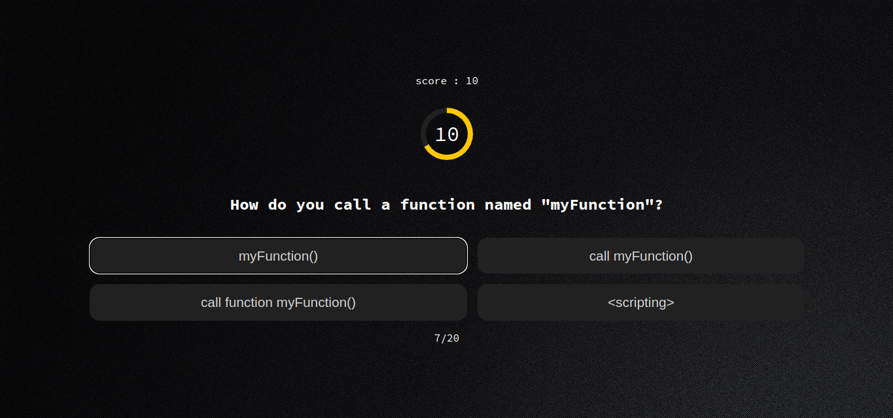

# A simple quiz app



## This project is a practice of what I learned recently, which is: How to use API in JavaScript

you can clone and use the source code in your own project but you have to get an API token from <a href="http://quizapi.io/" target="_blank" >QuizAPI</a>

and past it in "YOUR-API-KEY"

```javascript
let myHeaders = new Headers();
myHeaders.append("X-Api-Key", "YOUR-API-KEY");
```
